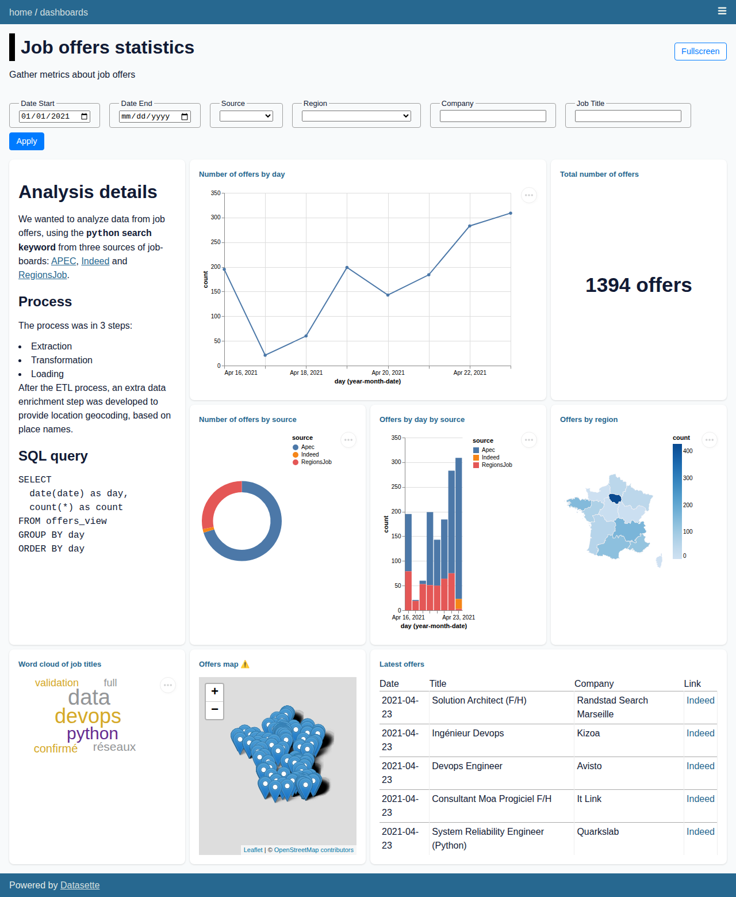

# datasette-dashboards

> Datasette plugin providing data dashboards from metadata

[](https://pypi.org/project/datasette-dashboards/)
[](https://github.com/rclement/datasette-dashboards/actions/workflows/test.yml)
[](https://github.com/rclement/datasette-dashboards/actions/workflows/demo.yml)
[](https://github.com/simonw/datasette-graphql/blob/master/LICENSE)

Try out a live demo at [https://datasette-dashboards-demo.vercel.app](https://datasette-dashboards-demo.vercel.app/-/dashboards)

**WARNING**: this plugin is still experimental and not ready for production.
Some breaking changes might between releases before reaching version 1.0.0.
Use it at your own risks!



## Installation

Install this plugin in the same environment as Datasette:

```bash
$ datasette install datasette-dashboards
```

## Usage

Define dashboards within `metadata.yml` / `metadata.json`:

```yaml
plugins:
  datasette-dashboards:
    my_dashboard:
      title: My Dashboard
      description: Showing some nice metrics
      layout:
        - [chart1]
        - [chart2]
      charts:
        - title: Number of events by day
          db: jobs
          query: SELECT date(date) as day, count(*) as count FROM events GROUP BY day ORDER BY day
          library: vega
          display:
            mark: { type: line, tooltip: true }
            encoding:
              x: { field: day, type: temporal }
              y: { field: count, type: quantitative }
        - title: Number of events by source
          db: jobs
          query: SELECT source, count(*) as count FROM events GROUP BY source ORDER BY count DESC
          library: vega
          display:
            mark: { type: bar, tooltip: true }
            encoding:
              color: { field: source, type: nominal }
              theta: { field: count, type: quantitative }
```

A new menu entry is now available, pointing at `/-/dashboards` to access all defined dashboards.

### Properties

Dashboard properties:

| Property      | Type     | Description           |
| ------------- | -------- | --------------------- |
| `title`       | `string` | Dashboard title       |
| `description` | `string` | Dashboard description |
| `layout`      | `array`  | Dashboard layout      |

Common chart properties for all chart types:

| Property  | Type     | Description                                              |
| --------- | -------- | -------------------------------------------------------- |
| `title`   | `string` | Chart title                                              |
| `db`      | `string` | Database name against which to run the query             |
| `query`   | `string` | SQL query to run and extract data from                   |
| `library` | `string` | One of supported libraries: `vega`, `markdown`           |
| `display` | `object` | Chart display specification (depend on the used library) |

#### Vega properties

Available configuration for `vega` charts:

| Property  | Type     | Description               |
| --------- | -------- | ------------------------- |
| `library` | `string` | Must be set to `vega`     |
| `display` | `object` | Vega specification object |

Notes about the `display` property:

- Requires a valid [Vega specification object](https://vega.github.io/vega-lite/docs/)
- Some fields are pre-defined: `$schema`, `title`, `width`, `view`, `config`, `data`
- All fields are passed along as-is (overriding pre-defined fields if any)
- Only `mark` and `encoding` fields are required as the bare-minimum

#### Markdown properties

Available configuration for `markdown` chart:

| Property  | Type     | Description                                       |
| --------- | -------- | ------------------------------------------------- |
| `library` | `string` | Must be set to `markdown`                         |
| `display` | `string` | Multi-line string containing the Markdown content |

Note :

- Some common properties do not apply and can be omitted: `title`, `db`, `query`
- Markdown rendering is done by [`datasette-render-markdown`](https://datasette.io/plugins/datasette-render-markdown)
- To configure Markdown rendering, extensions can be enabled in [metadata](https://datasette.io/plugins/datasette-render-markdown#user-content-markdown-extensions)

### Dashboard layout

The default dashboard layout will present two charts per row (one per row on mobile).
To make use of custom dashboard layout using [CSS Grid Layout](https://developer.mozilla.org/en-US/docs/Web/CSS/CSS_Grid_Layout),
define the `layout` array property such as:

- Each entry represents a row of charts
- Each column is referred by the 1-indexed chart in the list (e.g. "chart1", "chart2, etc.)

## Development

To set up this plugin locally, first checkout the code.
Then create a new virtual environment and the required dependencies:

```bash
pipenv install -d
pipenv shell
```

To run the tests:

```bash
pytest
```

## Demo

With the developmnent environment setup, you can run the demo locally:

```bash
datasette --metadata demo/metadata.yml demo/jobs.db
```

## License

Licensed under Apache License, Version 2.0

Copyright (c) 2021 - present Romain Clement
